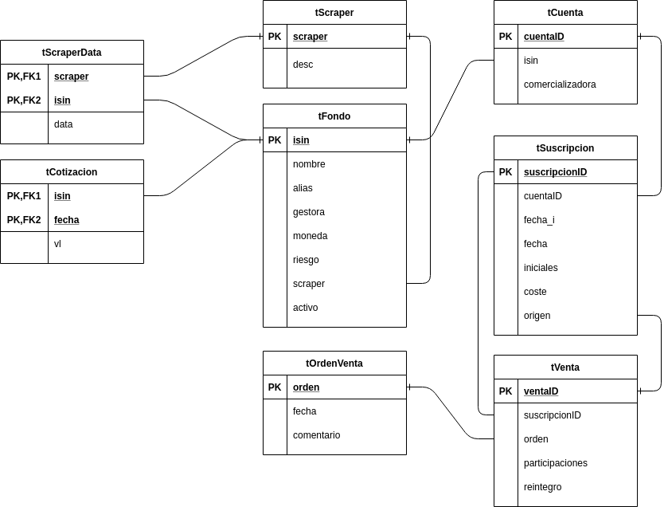

# Gestión de fondos
La aplicación se propone ayudar a la gestión de las inversiones personales en
fondos de inversión y para ello consta de una base de datos
[SQLite](https://www.sqlite.org/index.html) y una pequeña y muy precaria
aplicación escrita e Python para simplificar la consulta y hacer los apuntes.

## Descripción del producto financiero
Un **fondo** de inversión es un producto financiero de inversión colectiva en
el que un gestor capta una cantidad de dinero (patrimonio) con el propósito de
invertirlo de forma conjunta. Las aspectos más destacados pueden resumirse en:

- Las gestoras dividen el patrimonio del fondo en participaciones, y son estas
  divisiones las que venden y compran los inversores finales a través de
  terceros intermediarios llamados comercializadoras. Por ejemplo, si el fondo
  "F" parte con un patrimonio de 50 millones de euros y se divide en 250.000
  participaciones, cada participación costará 200 euros. Para captar esta suma
  la gestora "G" vende las 250.000 participaciones a través de distintas
  comercializadoras. Las participaciones, sin embargo, no son indivisibles, por
  lo que un inversor final puede comprar (o vender posteriormente) un número de
  participaciones no entero. Por ejemplo, puede comprar 10,21 participaciones y
  no exclusivamente 10 u 11. Es, por ello, que cuando un inversor ordena una
  compra puede hacerlo redondeando el precio de compra (p.e. 5000), aunque esto
  provoque que el número de participaciones no resulte un entero.

- La gestora se encarga de invertir el patrimonio del fondo, labor por la que
  cobra necesariamente una comisión de gestión, puesto que el patrimonio es
  propiedad de los participantes y, en consecuencia, las ganancias tambiéń lo
  son. Pueden existir también comisiones de compra y venta.

- Como el patrimonio no es dinero muerto, sino que se invierte de 
  distintos modos (bolsas, deudas públicas, deudas corporativas, inmobiliario,
  etc.), el patrimonio fluctúas según la suerte de las inversiones, y, en
  consecuencia, las participaciones también. Por ese motivo, la gestora cálcula
  diariamente el valor de la participación retrayendole la comisión de gestión.
  En consecuencia, en ausencia de comisiones por las operaciones de compra y
  venta, siempre será posible conocer el coste por una compra o el rembolso por
  una venta utilizando el número de participaciones, la fecha de la operación y
  el valor de cotización de ese día.

- Para llever a cabo una inversión se compran participaciones de un fondo y para
  recuperar la inversión se venden. Obviamente, al vender deben pagarse impuestos
  sobre los beneficios:

  | Beneficio | Impuesto
  | --: | :--:
  | ``B<6000`` euros | 19%
  | ``6000<=B<=50000`` euros | 21%
  | ``B>50000 euros`` | 23%

  El beneficio es, simplemente, la diferencia entre el capital obtenido por la
  venta y el capital inicial de inversión, que, en principio, será el capital de
  adquisición.

- No obstante, fiscalmente existe el concepto de *traspaso* que consiste en la
  venta de participaciones de un fondo con el propósito de comprar
  participaciones de otro fondo distinto. Un traspaso, pues, son simplemente dos
  operaciones, una de venta y otra de compra posterior, pero la operación de
  venta no genera pago de impuestos puesto que la comercializadora nunca llega a
  ingresar el rembolso, sino que lo reinvierte de inmediato en la compra con la
  sola particularidad de que se heredan de las participaciones vendidas

  + La fecha de inversión que, por tanto, no coincidirá con el día de compra
    como sucede en las compras hechas con dinero nuevo.
  + El capital de inversión que, por tanto, no será el capital de adquisión.

- Para almacenar las participaciones de un fondo adquiridas por un cliente,
  las comercializadoras abren una *cuenta partícipe*. En consecuencia, por cada
  fondo habrá en cada comercializadora una cuenta partícipe distinta.

- Cada compra de participaciones de un fondo se denomina suscripción, para cada
  una de las cuales debe anotarse el número de participaciones adquiridas, el
  coste la operación y la fecha de inversión.

- Las cuentas partícipes son cuentas FIFO, lo que quiere decir que al venderse
  (o traspasarse) participaciones se venden antes las participaciones con
  fecha de inversión anterior. Esta es la razón por la que es importante conocer
  la fecha de inversión de las participaciones.

## Modelo SQL
Para construir el modelo de tablas relacionales se parte de que, dado que la
fecha de inversión determina cuáles son las participaciones de una cuenta
partícipe que se venden y que a diferente tiempo de inversión el beneficio será
distinto. se deben tratar de forma separada las aportaciones monetarias
individuales.

Sin embargo, en la operativa normal es común que, cuando se venden (o traspasan)
participaciones se indique como origen una cuenta partícipe sin atender a si sus
participaciones procceden de una misma o distintas suscripciones. La vistas
que se definen sobre las tablas permiten esta operativa y traducen esas
operación agregadas a las operaciones atómicas sobre participaciones de una
misma suscripción.

### Tablas
La relación de tablas en la base de datos es la siguiente (todas tienen una *t*
minúscula en su nombre para distinguirlas de las tablas):

```
tScraper(scraper*, desc)
tFondo(isin*, nombre, alias, gestora, moneda, riesgo, scraper[tScraper], activo)
tScraperData((scraper, isin)*, data)
tCotizacion((isin, fecha)*, vl)
tCuenta(cuentaID*, isin[tFondo], comercializadora)
tSuscripcion(suscripcionID*, cuentaID[tCuenta], fecha_i, fecha, iniciales, coste, origen[tVenta])
tOrdenVenta(orden, fecha, comentario)
tVenta(ventaID, suscripcionID[tSuscripcion], participaciones, reintegro)
```



+ **tScraper**: Relación de *scrapers* capaces de obtener cotizaciones de fondos. La
  programación de cada *scraper* es responsabilidad de la aplicación externa que
  use la base de datos.

+ **tFondo**: Relación de fondos con sus características substanciales. Hay dos
  campos, no obstante, ajenos a estas características, pero relacionados con el
  uso:

  * ``activo``, que es un valor lógico para notar si el fondo debe considerarse
    activo (p.e. a efectos de obtener sus cotizaciones mediante un *scraper*).
  * ``scraper``, que es el nombre del scraper que se usará para obtener
    cotizaciones.

+ **tScraperData**: Define qué dato debe usar el *scraper* (p.e. qué URL) para
  obtener la cotización de cada fondo.

+ **tCotizacion**: Relación de valores liquitativos de los fondos.

+ **tCuenta**: Relación de cuentas partícipes. A las cuentas se asocian
  suscripciones y ventas que van alterando en el tiempo el número de
  participaciones adscritas a ella.

+ **tSuscripcion**: Relación de suscripciones. Una *suscripción* es una compra
  de participaciones de un determinado fondo y recoge toda la información
  relevante de esa compra. Su identificador es un número intero autoincremental.

  Como una suscripción puede proceder de la venta de otra suscripción previa y,
  en este caso, la fecha de inversión se hereda, la tabla incluye el campo
  ``fecha_i``. Su valor sólo coincidirá con el de ``fecha`` (la de compra) si la
  suscripción se constituye con una nueva aportación. El campo ``origen`` indica
  si la suscripción procede de la reinversión de una venta (o sea, de un
  traspaso).

+ **tOrdenVenta**: Relación de órdenes de venta. Como en la realidad se ordenan
  ventas de un determinado número de participaciones de una cuenta, sin
  considerar si esas participaciones pertenecen a una o más suscripciones, se
  define esta tabla, que permite caracterizar ventas de suscripciones
  pertenecientes a una misma orden.

+ **tVenta**: Relación de las ventas que se hacen de una cantidad de
  particiopaciones asociadas a una suspcripción. Por tanto, las partipaciones
  recogidas en un registro de *tVenta* proceden de un única suscripción. Si una
  acción de venta incluye participaciones de dos o más suscripciones, entonces
  se generaran dos o más registros. Es por esa razón que existe el campo
  ``orden`` que sí será común a esos registros. Su identificador es un número
  intero autoincremental. Sin embargo, hay libertad para definir el número de
  orden.

### Vistas
Sus funciones son:

- Simplificar algunas vistas.
- Desagregar en suscripciones la operativa sobre cuentas partícipes.

Las relación de vistas relevantes es:

+ **Fondo**: Su definición es:

  ```
  Fondo(isin, nombre, alias, gestora, moneda, riesgo, scraper, scraper_data, activo)
  ```

  Fusiona la información de un fondo con asociada a su *scraper*. Permite
  agregar nuevas fondos incluyendo información sobre el scraper, que se añadirá
  a sus respectivas tablas.

  Cuando la información adicional para el *scraper* no existe, ``scraper_data``
  toma el valor del isin. Además, si se actualiza el registro utilizando
  para ``scraper_data`` NULL como valor, la información que pudiera haber en la
  tabla *ScraperData*, se borrará.

+ **Suscripcion**: La vista recoge cuántas son las participaciones que aún se
  conversan de la suscripción original. El campo ``coste`` sólo cuenta el coste
  de estas participaciones. Por su parte, ``fecha`` es la fecha de la operación,
  no la fecha de inversión.

  ```
  Suscripcion(suscripcionID*, cuentaID[tCuenta], fecha, participaciones, coste, origen[tVenta])
  ```

  Esta el la vista en la que deben insertarse las compras hechas con dinero
  nuevo. Si no hay comisiones de ccmpra, puede dejarse vacío el campo de coste o
  el de participaciones, y éste se calculará en cuanto esté disponible el valor
  liquidativo del día de la operación. La inserción mediante la vista, además,
  controla el número de decimales de los números reales.

+ **Venta**: Vista que preseta de modo conjunto las ventas con la orden
  a la que pertenencen:

  ```
  Venta(ventaID, orden, suscripcionID[tSuscripcion], fecha, participaciones, reintegro, comentario)
  ```

  La vista (aunque es preferible usar ``VentaAggr``) permite registrar ventas
  controlando que la suscripción que se vende tenga definido su número de
  participaciones y que sea adecuando el número de decimales que se incriben en
  los campos numéricos. En general, basta con expresar una de las dos cantidades
  (o reintegro y participaciones), pero puede ocurrir:

  + Que no se defina ninguna, en cuyo caso se supone que se vende totalmente
    la suscripción.
  + QUe se definen ambas, útil cuando existe comisión de venta y no puede
    deducirse una a partir de la otra utilizando el valor de cotización.

  En cuanto al número de orden, si éste ya existe en ``tOrdenVenta`` se
  considerará que la venta de la suscripción pertenece a esa misma orden, si no
  existe o es ``NULL``, se generará una orden nueva. Tenga presente que los
  campo ``fecha`` y ``comentario`` sólo son tenidos en cuenta cuando se genera
  una nueva orden.

+ **Traspaso**: Implementa la venta de participaciones pertenecientes a una
  única suscripción para la suscripción inmediata de participaciones de otra
  cuenta. Internamente supone una venta (registrada en la tabla ``tVenta``),
  una suscripción (registrada en ``tSuscripcion``); y, si la orden es nueva o
  ``NULL``, un registro en ``tOrdenVenta``.

  ```
  Traspaso(traspasoID, orden, origen, fecha_v, part_v, monto, destino, fecha_c, part_c, comentario)
  ```

  Los cinco primeros campos, aunque puedan tener distinto nombre, son los campos
  del reghstro de venta, por lo que el identificador del traspaso es el mismo
  que el de la venta que lo origina. Los tres campos últimos definen la
  suscripción con la que invierte el monto de la venta; por lo que, en realidad,
  también el campo ``monto`` forma parte del registro de suscripción. En
  consecuencia, ``origen`` es un identificador de suscripción, pero ``destino``
  es una cuenta partícipe.

  Si no se se especifica fecha de compra se sobrentiende que coincide con la de
  venta y, en ausencia de comisiones de compra y venta, basta en principio con
  expresar las participaciones de venta. ya que los demás puede calcularse
  conocinedo los valores liquidativos de origen y destino.

  Para llevar a cabo un cambio de comercializadora, exprese sólo la fecha y las
  participaciones de venta, y un origen y destino que se corresponda con un
  mismo fondo.

+ **VentaAggr**: Define una venta agregada cuyo origen es una cuenta partícipe.
  Su inserción provocará, en realidad, la inserción de uno o varios registros de
  venta de suscripciones de la cuenta referida:

  ```
  VentaAggr(orden, cuentaID, fecha, participaciones, reintegro, comentario)
  ```

  El número de orden puede dejarse a ``NULL``, en cuyo caso se tomara un numero
  libre. En cambio, si se toma un número ya existente se producirá un error.

+ **TraspasoAggr**: Define un trapaso agregado cuyo origen es una cuenta
    partícipe:

  ```
  TraspasoAggr(orden, origen, fecha_v, part_v, monto, destino, fecha_c, part_c, comentario)
  ```

  Se comporta exactamente del mismo modo que ``VentaAggr`` con la salvedad de
  que, además, genera una o varias suscripciones con el rembolso.

+ **Cartera**: Muestra la rentabilidad de una cuenta partícipe como la suelen
  mostrar las comercializadoras, esto es, la rentabilidad sumanda de todas sus
  suscripciones, pero sólo desde las fechas de compra de tales sucripciones. En
  consecuencia, si un grupo de participaciones procede de traspaso, no se tiene
  en cuenta la rentabilidad que hasta el momento de tal traspaso pudieron tener
  esas participaciones:

  ```
  Cartera(isin, cuentaID, comercializadora, capital, fecha, vl, participaciones, valoracion, plusvalía)
  ```

  En este caso el campo ``capital`` es la suma del coste de adquisión de las
  participaciones de la cuenta partícipe (que no coincidirá con el coste
  original de adquisión si parte o todas las participaciones proceden de
  traspaso) y ``fecha`` y ``vl`` son la ultima fecha de la que se dispone de
  valor liquidativo y el propio valor liquidativo. Los últimos campos permiten
  conocer la rentabilidad. El primero es la ``valoración`` de las
  participaciones tomando como referencia ``vl`` y la ``plusvalía`` la ganancia
  (o pérdida) sobre ``capital`` en tanto por ciento.

+ **CarteraHistorica**: Conceptualmente presenta lo mismo que la anterior, pero
    permite fijar la fecha inicial a partir de la cual se observan las
    inversiones y la fecha final en que se valoran.

    ```
    CarteraHistorica(isin, cuentaID, comercializadora, capital, fecha, vl, participaciones, valoracion, plusvalía)
    ```

    Por ejemplo, supongamos una cartera muy simple constituida por una única
    cuenta partícipe en que se compraron participaciones el primer día de 2010 y
    el primer día de 2015. La vista _Cartera_ considerará capital la suma del
    del dinero invertido en 2010 y el invertido en 2015; y la valoración se hará
    con la última cotización disponible. En cambio esta vista, obliga a
    proporcionar una fecha inicial y una final:

    + Dada la fecha final se valora la cartera tomando la última cotización
      disponible hasta esa fecha, pero sólo si las participaciones ya se habían
      comprado. Por tanto, si la fecha final es anterior a 2015, las segundas
      participaciones se excluyen. Si la fecha final es NULL, se sobrentiende
      que es hoy.
    + La fecha inicial sirve para tomar como capital el valor de las
      participaciones en ese momento (esto es tomando la última cotización
      disponible hasta esa fecha). Si la suspcripción se produjo después de esa
      fecha, se toma como capital el capital de adquisición. Por tanto, si la
      fecha inicial es anterior a 2015 y posterior al inicio de 2010, el capital
      para las primeras participacione se tomará como su valor en esa fecha y el
      capital para las segundas como lo que costó adquirirlas. Si se proporciona
      como fecha NULL, se toman los capitales de adquisición.

    Para proporcionar las fechas a la vista debe usar CTE:

    ```sql
    WITH FechaInicial AS (SELECT NULL),
         FechaFinal   AS (SELECT '2020-09-10')
    SELECT * FROM CarteraHistorica;
    ```

+ **Plusvalia**: Muestra la plusvalía fiscal de cada una de las ventas y de las
  participaciones que aún se conservan. Así pues, esta vista si tiene en cuenta
  que las participaciones han podido sufrir diversos traspasos y compara la
  suscripción inicial que se hizo con dinero nuevo con la venta o la suscripción
  actual en la que se encuentran las participaciones.

  ```
  Plusvalia(desinversion, fecha_i, capital, origen, fecha_v, orden, suscripcionID, cuentaID, participaciones, rembolso)
  ```

  * ``desinversion`` es el identificador de la suscripción final que se vendió o
      bien de la que se conservan las participaciones.
  * ``fecha_i`` es la fecha de inversión de participaciones.
  * ``capital`` es la capital invertido inicialmente.
  * ``origen`` es la suscripcion que originó la inversión.
  * ``fecha_v`` es la fecha de venta o, si no la hay, la última fecha de
      cotización del fondo en que se encuentran invertidas las participaciones.
  * ``orden`` es el número de orden de venta. Si las participaciones aún se
      conservan, entonces es **0**.
  * ``suscripcionID`` es el identificador de la suscripción en la que han
      acabado las participaciones.
  * ``cuentaID`` es la cuenta partícipe en la que han acabado las
      participaciones.
  * ``participaciones`` es el número de participaciones que se vendieron o que
      se conservan.
  * ``rembolso`` es el dinero obtenido por la venta o, si no ha habido venta, la
    estimación del dinero obtenido usando el último valor liquidativo.

+ **Evolucion**: Muestra la evolución en el tiempo del beneficio de cada una de
  las inversiones listadas en la vista **Plusvalia**. Se puede definir como
  intervalo "meses" o "semanas":

  ```
  Evolucion(periodo, desinversion, suscripcionID, orden, coste,
            fecha_c, fecha_v, participaciones, isin, fecha, rembolso)
  ```

  En este caso `fecha` es la fecha en la que se obtiene el ``rembolso``.
  Obsérvese que si entre la fecha de compra y la fecha de venta de la
  suscripción median 4 meses y el periodo de tiempo seleccionado es "meses", el
  registro de *Plusvalía* generará cuatro registros en esta vista.

  La vista añade, además, registros para conocer cuáles fueron las fechas
  equiespaciadas que se tomaron para obtener los datos de rembolsos. En estos
  registros el campo ``desinversion`` es ``NULL`` y sólo tienen valor
  ``periodo`` y ``fecha``.

  La vista es muy útil para generar un gŕáfico con la evolución de las
  inversiones.

## Ejemplos de uso

1. Creando fondos:

   * Añadir un nuevo *scraper* a la base de datos:

     ```sql
     INSERT INTO tScraper VALUES ('investing', 'Cotizaciones de investing.com');
     ```

   * Añadir un nuevo fondo incluyendo información sobre cómo obtener sus
     cotizaciones:

     ```sql
     INSERT INTO Fondo VALUES ('LU0113257694', 'Schroder International Selection Fund EURO Corporate Bond A Acc',
        'Schroder Deuda Corp', 'Schroder', 'EUR',. 3, 'investing', 'sieuro-corporate-bond-a-acc-historical-data', 1);
     ```

     Esta orden, además de añadir un registro a ``tFondo``, añade un registro a
     ``tScraperData``:

     ```
     scraper    isin          data
     ---------  ------------  -------------------------------------------
     investing  LU0113257694  sieuro-corporate-bond-a-acc-historical-data
     ```

   * Elimina el registro anterior de ``tScraperData``:

     ```sql
     UPDATE Fondo SET scraper_data = NULL WHERE isin = 'LU0113257694';
     ```

    Al no existir ya dato especifico para el fondo, se usará el propio isin como
    dato:

    ```sql
    SELECT scraper_data FROM Fondo WHERE isin = 'LU0113257694';
    LU0113257694
    ```

   * Fija un nuevo dato para que el *scraper* "*investing*" obtenga este fondo:

     ```sql
     UPDATE Fondo SET scraper_data = 'sieuro-corporate-bond-a-acc-historical-data' WHERE isin = 'LU0113257694';
     ```

   * Cambia el *scraper* de un fondo (el *scraper* debería haberse definido
     antes):

     ```sql
     INSERT INTO tScraper VALUES ('vinea', 'Cotizaciones gracias a Unicaja');
     UPDATE Fondo SET scraper = 'vinea' WHERE isin = 'LU0113257694';
     ```

1. Creando cuentas partícipes:

   ```sql
   INSERT INTO tCuenta VALUES ('Cuenta para Schorder Deuda Corp',  'LU0113257694', 'Bancolchón');
   ```

1. Añadiendo una suscripción a la tabla:

   ```sql
   INSERT INTO Suscripcion VALUES (NULL, 'Cuenta para Schorder Deuda Corp', '2020-12-21', NULL, 5000, NULL);
   INSERT INTO Suscripcion VALUES (NULL, 'Cuenta para Schorder Deuda Corp', '2020-12-22', 200, NULL, NULL);
   ```

   La suscripción se ha añadido indicando cuánto dinero se ha invertido, por lo
   que para conocer cuántas participaciones se han comprado, es necesario tener
   el dato de la cotización del fondo el día de compra. Si tal valor de
   cotización ya existe en ``tCotizacion``, se hará el cálculo antes de pasar
   el registro a la tabla ``tSuscripcion`` y se sutituirá el valor nulo por su
   valor correspondiente. Si no es así, se apuntará ``NULL``, pero, cuando se
   registre el valor de la cotización, un disparador calculará las
   participaciones y actualizará el registro. Se obrá de indentica manera si en
   vez del coste, se expresan las participaciones. Por supuesto, se pueden
   expresar ambas a la vez, sobre todo si existen comisiones qie impidan
   relacionar uno y otro dato mediante la cotización.

   El último campo (``origen``) siempre debe ser nulo, ya que sólo deben
   añadirse suscripciones que inviertan nuevo dinero. Las reinversiones se hacen
   automáticamente utilizando ``Traspaso``.

1. Añadiendo cotizaciones:

   ```sql
   INSERT INTO tCotizacion VALUES ('LU0113257694', '2020-12-21', 24.7623);
   INSERT INTO tCotizacion VALUES ('LU0113257694', '2020-12-22', 24.7444);
   ```

1. Vendiendo participaciones:

   Para vender participaciones es necesario conocer previamente las
   participaciones que tenemos en la cuenta. Por lo tanto, con nuestros ejemplos
   habría sido necesario añadir, al menos, la cotización del día 21 de
   diciembre.

   * Venta parcial (de un número determinado de participaciones):

     ```sql
     INSERT INTO VentaAggr VALUES (NULL,  -- Se cree automáticamente el núm. de orden
                                   'Cuenta para Schorder Deuda Corp',  -- cuenta
                                   '2020-12-23',  -- fecha de venta.
                                   300,  -- Número de participaciones vendidas.
                                   NULL,  -- reintegro = VL*participaciones.
                                   "Venta de prueba");
     ```

     La consecuencia de esta inserción es que, en realidad, se crean dos registro
     en ``tVenta``, uno que vende todas las participaciones del día 21 y otro que
     vende parte de las participaciones del día 22.  Por ello:

     ```sql
     SELECT suscripcionID, fecha, participaciones FROM Suscripcion;
     suscripcionID  fecha       participaciones
     -------------  ----------  ---------------
     1              2020-12-21  0.0
     2              2020-12-22  101.91985
     ```

     En este caso, el reintegro que se produce por la venta se calcurá cuando se
     tenga la cotización del día 23.

     Si se intentan vender más participaciones de las existentes en la cuenta
     partícipe (p.e. **500**), se generará un error.

   * Venta total (se venden todas las participaciones de la cuenta partícipe):

     ```sql
     INSERT INTO VentaAggr VALUES (NULL, 'Cuenta para Schorder Deuda Corp',
                                   '2020-12-23', NULL, NULL, "Venta de prueba");
     ```

1. Realizando traspasos:

   La operativa es análaga a la de venta, excepto por el hecho de que hay que
   indicar cuál será el destino de la venta:

   * Traspaso entre cuentas de distinto fondo:

     ```sql
     INSERT INTO TraspasoAggr VALUES (NULL,  -- Se crea automáticamente el núm. de venta
                                      'Cuenta para Schorder Deuda Corp',  -- origen
                                      '2020-12-23', -- fecha de venta
                                      NULL,  -- Traspasamos todas las participaciones
                                      NULL,  -- Reintegro calculado con el VL.
                                      'Cuenta de otro fondo',  -- cuenta de destino
                                      '2020-12-26',  -- Fecha de compra
                                      NULL,  -- Part. calculadas usando el VL.
                                      "Traspaso de prueba");
     ```

     Como no se especifican las participaciones que se venden, se supone que el
     traspado es total y no quedarán participaciones en la cuenta de origen. En
     este caso, se supone que no hay comisiones de venta ni de compra, por lo que
     todos los datos faltantes pueden obtenerse conociendo el valor liquidativo
     del fondo de origen el día 23 y el del fondo de destino el día 26. El
     primero es necesario conocerlo antes de registrar el traspaso pues el único
     de modo de saber cuántas dinero reinvertimos en el fondo de destino. El
     segundo, en cambio, puede registrarse en la base de datos después.

   * Cambio de comercializadora:

     ```sql
     INSERT INTO TraspasoAggr VALUES (NULL, 'Cuenta para Schorder Deuda Corp', '2020-12-23', 250, NULL,
                                      'Cuenta del mismo fondo', NULL, NULL, "Traspaso de prueba");
     ```

     En este caso, el valor liquidativo del fondo el día 23 es irrelevante,
     puesto que las participaciones en la cuenta de destino también son **250**.

1. Consultando las cuentas partícipes activas:

   ```sql
   SELECT * FROM Inversion  WHERE participaciones > 0 ORDER BY comercilizadora;
   ```

1. Consultando las plusvalías obtenidas por cada inversión:


   ```sql
   SELECT orden, cuentaID, fecha_i, capital, fecha_v, participaciones, rembolso
   FROM Plusvalia;
   ```
1. Obteniendo los datos para representar una gráfica de la evolución temporal de
   todas las inversiones:

   * Datos de la evolución de la desinversión **45**:

     ```sql
     SELECT desinversion || "/" || orden AS 'inversion',
            fecha,
            ROUND(rembolso/coste - 1, 4) AS 'beneficio'
     FROM Evolucion WHERE periodo = 'meses' AND desinversion = 45;
     ```

   * Fechas equiespaciadas por meses para generar el eje de abcisas:

     ```sql
     SELECT fecha FROM Evolucion WHERE desinversion IS NULL and periodo = 'meses';
     ```

## Script en Python
El *script* se limita a conectar con la base de datos y ofrecer una interfaz CLI
menos árida que las ordenes SQL. Para conocer su uso:

```console
$ ./fondos.py -h
```

La introducción de datos se hace a través de ficheros cuyas líneas contienen los
campos requeridos separados por "|", pero que no siguen estrictamente el orden
de los campos definido en la base de datos:

* **Fondos**: 

  ```
  isin |nombre |alias |gestora |scraper |riesgo |activo |moneda  |scraper data
  ```

* **Cuentas**:

  ```
  cuentaID  |isin   |comercializadora
  ```

* **Suscripciones**

  ```
  cuentaID  |fecha  |coste  |participaciones
  ```

* **Cotizaciones**

  ```
  isin  |fecha  |vl
  ```
* **Ventas**

  ```
  cuentaID  |fecha  |participaciones  |reintegro  |comentario
  ```

* **Traspasos**

  ```
  origen  |fecha_v  |destino  |fecha_c  |part_v  |rembolso  |part_c  |comentario
  ```
